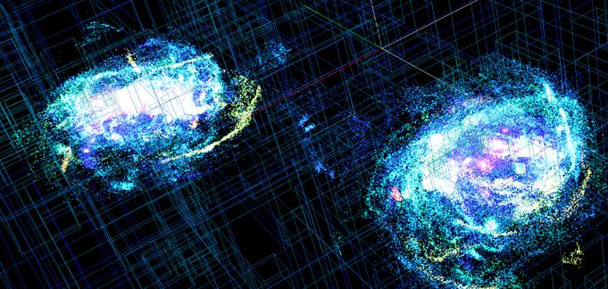

## Física Computacional - UFMS

Este repositório contém estudos, atividades e provas resolvidas das
disciplinas de Física Computacional do Instituto de Física da UFMS
ministradas pelo Prof. Titular Marcos S. do Amaral durante os períodos
de 2022/2 e 2023/1.

Todos os códigos estão sob licença GNU GPLv3.